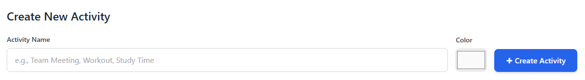
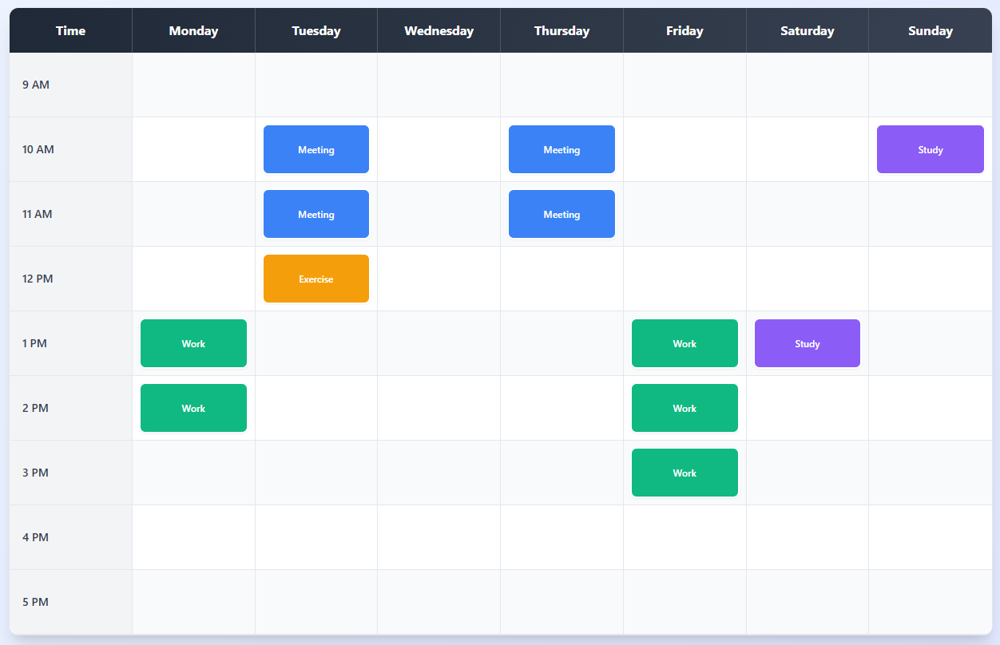
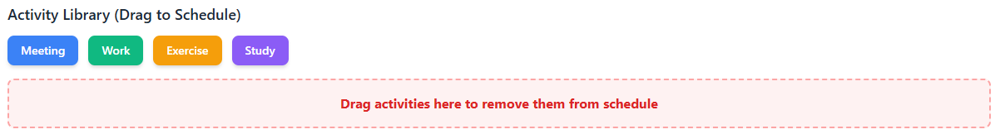

# Weekly Planner App

A visual drag-and-drop weekly schedule builder designed for intuitive time management and planning.

## Description and Purpose

The Weekly Planner App addresses the common challenge of organizing weekly schedules through a simple, visual interface. Unlike complex calendar applications, this tool focuses specifically on weekly routine planning with an emphasis on drag-and-drop functionality and visual time blocking.

The application enables users to create custom activities, assign colors for easy identification, and build their weekly schedules by dragging activities into specific time slots. Real-time analytics provide insights into time allocation patterns across different activity types.

## Installation and Setup

### Prerequisites
- Node.js (version 14 or higher)
- MongoDB (local installation or MongoDB Atlas account)
- Git

### Backend Setup
1. Clone the repository
```bash
git clone https://github.com/yourusername/weekly-planner-app.git
cd weekly-planner-app
```

2. Install server dependencies
```bash
cd server
npm install
```

3. Configure environment variables
Create a `.env` file in the server directory:
```
MONGODB_URI=mongodb://localhost:27017/weekly-planner
PORT=5000
```

4. Start the backend server
```bash
npm run dev
```

### Frontend Setup
1. Install client dependencies
```bash
cd client
npm install
```

2. Start the development server
```bash
npm start
```

The application will be available at `http://localhost:3000`

## Key Topics Used
- **GUI Frameworks - Tailwind CSS**
- **React Component Architecture**
- **React Event Handling**
- **State and Hooks Management**
- **D3.js Integration**
- **Mongoose & MongoDB**

## Features

### Core Functionality
- **Activity Creation**: Create custom activities with personalized names and color coding

- **Drag and Drop Interface**: Intuitive scheduling by dragging activities to time slots
- **Visual Time Blocking**: Clear visual representation of weekly commitments

- **Activity Management**: Comprehensive library of reusable activity types

- **Schedule Analytics**: Real-time data visualization showing time distribution patterns


### User Interface
- **Responsive Design**: Optimized for desktop and mobile viewing
- **Clean Layout**: Minimalist interface focusing on usability
- **Color Coordination**: Consistent color schemes across schedule and analytics
- **Interactive Feedback**: Visual cues for drag operations and hover states

### Data Management
- **Persistent Storage**: Schedule data saved to MongoDB database
- **Local Backup**: Automatic fallback to browser local storage
- **Real-time Updates**: Immediate synchronization between interface and database
- **Data Analytics**: Visual charts powered by D3.js for activity insights

## Technology Stack

### Frontend
- **React**: Component-based user interface framework
- **Tailwind CSS**: Utility-first styling framework
- **D3.js**: Data visualization and chart generation
- **@dnd-kit**: Modern drag and drop functionality

### Backend
- **Node.js**: Server-side JavaScript runtime
- **Express.js**: Web application framework
- **MongoDB**: NoSQL database for data persistence
- **Mongoose**: MongoDB object modeling library

## Demo Video

[Demo](https://www.loom.com/share/6ece5c6335c14c82bdf771f0c7c810bb?sid=5988345e-9e9b-4b5d-a1e0-b186a85afd17)
- Creating custom activities
- Drag and drop scheduling
- Analytics visualization

## Future Development Roadmap

### Possible Updates
- Template system for saving and reusing common schedules
- Export functionality for PDF and calendar formats
- Enhanced mobile interface optimizations
- Additional chart types for deeper analytics

## Technical Architecture

The application follows a modern full-stack architecture with clear separation between frontend and backend components. The React frontend manages state through custom hooks, while the Express backend provides RESTful API endpoints for data operations. MongoDB serves as the primary data store with automatic fallback to browser local storage.

Key design patterns include component composition, custom hooks for state management, and service-layer abstraction for API communications.

## Contributing

This project was developed as part of a full-stack web development course, demonstrating proficiency in modern JavaScript frameworks, database integration, and responsive design principles.

## Contact Information
### Haradeep Puneti  - haradeep@vt.edu 
